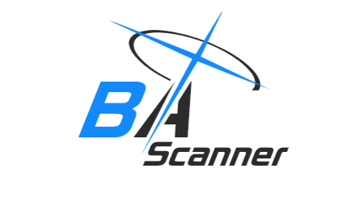

# Blue Archive Resources Scanner



A Python-based tool to scan and count owned resources in **Blue Archive**.

**Resolution**: Only supports 1280x720 resolution.

## Features

- **Scan Equipment and Item Page**: Automatically scan and count resources in the equipment and item page.
- **Scan Student Page**: Extract levels, skill tiers, gear, UE stars, and bond levels.

---

## Requirements

To use the Blue Archive Resources Scanner, ensure you have the following installed:

- **Python** (I use v3.13, but version 3.8 or higher should work fine)
- **Virtual Environment** (highly recommended)
- **RapidOCR** (installed automatically via `requirements.txt`)

> ⚠️ **No external OCR binaries needed.** The scanner uses `RapidOCR`, a lightweight ONNX-based engine that runs entirely in Python. You do **not** need to install Tesseract or configure system paths.

---

## Installation

1. Clone the repository:

   ```bash
   git clone https://github.com/FleetingComet/BA-Scanner.git
   cd BA-Scanner
   ```

   (You can skip this if you want)

   1b. Create & activate a virtual environment:

   ```bash
   uv venv --python 3.13.0
   .venv\Scripts\activate  # Windows
   source .venv/bin/activate  # macOS/Linux
   ```

2. Install the required Python packages (please use venv or something similar):
   ```bash
   pip install -r requirements.txt
   ```
   _(This installs `rapidocr onnxruntime`, `opencv-python`, and other required packages.)_

---

## Documentation

See the docs/website index for quick links to user and developer guides:
- [https://fleetingcomet.github.io/BA-Resource-Scanner-Docs/](https://fleetingcomet.github.io/BA-Resource-Scanner-Docs/)
- [`docs/REFERENCE.md`](docs/REFERENCE.md)

## Usage

### Running the Scripts

#### First Run & Configuration

The scanner now uses an interactive setup wizard. Run:

```bash
python launch.py
```

The wizard will guide you through:

1. **Platform Selection**: Emulator (MuMu, LDPlayer, etc.), Desktop Client, or Real Device.
2. **ADB Connection**: Lets you enter a custom IP/port. (Auto-fill ports coming soon)
3. **Scan Targets**: Choose which inventories to scan (`Equipment`, `Items`, `Students`, `Currencies`).
4. **Performance Tuning**: Adjust wait-time multipliers for slower devices or emulators.
5. **Data Sync**: Enable/disable automatic downloads of the latest game asset data.

Your choices are saved to `config/settings.json` and `config/screen_config.json`. You won't need to run the wizard again unless you want to change settings.

#### Running the Scanner

- **Standard Run** (uses saved settings):
  ```bash
  python launch.py
  ```
- **Edit Configuration** (re-run wizard with current values as defaults):
  ```bash
  python launch.py -e   # or --edit
  ```
- **Force Offline Mode** (skips network sync, runs directly):
  ```bash
  python main.py --offline
  ```

Once started, the scanner automatically navigates the game, captures screenshots, extracts data via **RapidOCR**, and saves results to the `output/` directory.

#### Output Files

After a successful scan, check the `output/` folder:

- `owned/scanned_counts.json` -> Raw item & equipment counts.
- `owned/scanned_students.json` -> Raw student stats
- `owned/scanned_currencies.json` -> AP, Credits, Pyroxene
- `equipment_final_values.json`, `items_final_values.json`, `students_final_values.json` -> Processed & mapped data ready for planning

#### Optional

##### 1. Convert to Justin Planner Format

Use the Justin Planner converter script to prepare your data:

```bash
python convert_justin_planner.py
```

This script will generate:

- **`output/converted_to_justin_planner.json`**: A file compatible with the Justin Planner tool.

##### 2. Merge into Your Own Data

To merge the converted data into your existing Justin Planner export:

1.  Save your Justin Planner export as `justin_data.json`.
2.  Place the file in the following directory:  
    **`input/justin_data.json`**
3.  Run the merger script:
    ```bash
    python merger_justin_planner.py
    ```
    This script will generate:
    - **`output/justin_data_final.json`**: The merged file containing the final combined data.
4.  Import the generated json to Justin Planner

---

## Roadmap

### Current Checklist:

- Read more resources (some of them needs modification, their [Search Region](/locations/search.py) are already defined)
  - [x] Credits
  - [x] Pyroxene
  - [x] Items Page
  - [x] Student stats
    - [x] Skill levels (eg.: M/M/7/8)
    - [x] Unique Equipment level (is UE50? or something)
    - [ ] UE60 etc...
- [ ] Different Resolution (also remove bars)
- [x] Make screen capturing faster
- [x] More accurate and faster data reading

Note: "y" for half completed

<!-- - [ ] Comet Haley -->
<!-- - [x] Earth (Orbit/Moon) -->

### Future Plans:

- Expand support for different resolutions (with bars and notch).
- [x] Make the tool more efficient and user-friendly.
- Support other platforms (Linux) (someone tested it using waydroid)
  - Develop an Android app for convenient usage (using Kotlin, pls help I have skill issue).

---

## Credits

This project was inspired by and credits:

- [Fate/Grand Automata (FGA)](https://github.com/Fate-Grand-Automata/FGA)
- [AzurLaneAutoScript (ALAS)](https://github.com/LmeSzinc/AzurLaneAutoScript)
- [SchaleDB](https://github.com/SchaleDB/SchaleDB)

---

## Contributing

I welcome contributions to enhance the Blue Archive Resources Scanner. Please open an issue or submit a pull request if you'd like to help. Be sure to read the [Contribution Guide](CONTRIBUTING.md) for more information.

---

## License

This project is licensed under the MIT License. See the [LICENSE](LICENSE) file for details.

---
